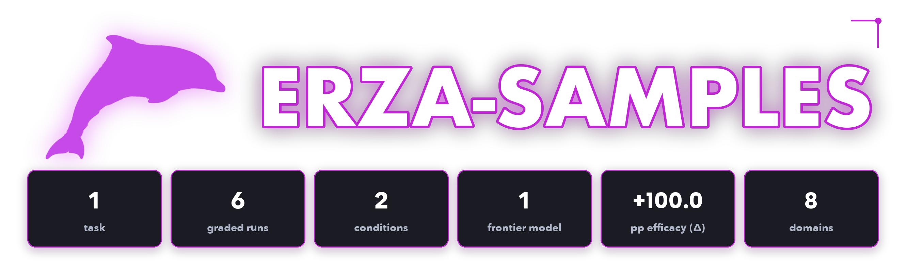
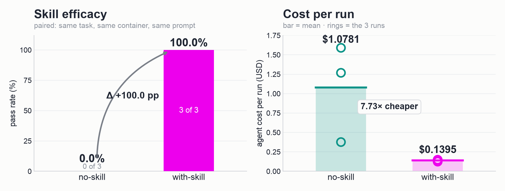
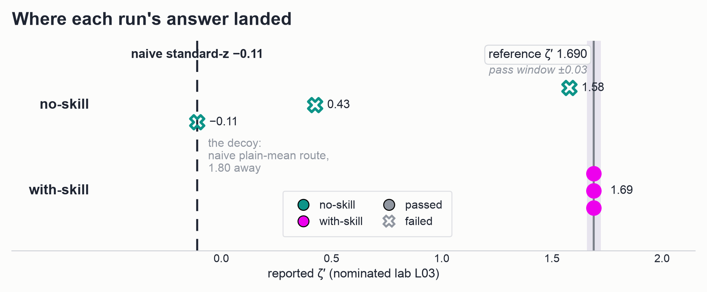

<p align="center">
  
</p>

<p align="center">
  <a href="#summary"></a>
  <a href="#metric-skill-efficacy-δ"></a>
  <a href="#scoring-methodology"></a>
  <a href="#verification-and-quality-assurance"></a>
</p>

<p align="center"><sub>
  <a href="#summary">Summary</a> · <a href="#repository-layout">Layout</a> · <a href="#metric-skill-efficacy-δ">Metric</a> · <a href="#results">Results</a> · <a href="#analysis">Analysis</a> · <a href="#dataset-structure">Dataset</a> · <a href="#trajectory-structure">Trajectories</a> · <a href="#scoring-methodology">Scoring</a> · <a href="#reproduction">Reproduction</a> · <a href="#verification-and-quality-assurance">Verification</a>
</sub></p>

# Erza: Agent-Skills Efficacy Sample

**Erza measures whether a curated Skill changes what an agent can actually do, not whether a model
is good at a domain.** Every task is run twice under identical conditions — same container, same
prompt, same verifier — differing only in whether a curated, domain-specific Skill is mounted. The
headline measurement is **Skill efficacy (Δ)**: the paired difference the Skill makes on the same
task.

A task earns its place in Erza only when it is hard enough to defeat the no-Skills arm **and**
separable enough that the Skill recovers it. A task the model already passes unaided is below the
bar; a task neither arm can solve measures difficulty, not Skill efficacy.

This is a **single-task orientation sample**: one complete task bundle paired with six graded agent
trajectories (Claude Opus 4.8, 2 conditions × 3 runs). The dataset format, trajectory format, and
scoring are identical to the production Erza harness.

> **Scope.** This sample exists to show the *shape* of an Erza deliverable end-to-end. Three runs
> per arm cannot establish an efficacy estimate — see [Limitations](#limitations).

## Summary

| Property            | Value                                                                    |
| :------------------ | :----------------------------------------------------------------------- |
| Tasks               | **1** (`d427488f` — ERZA-RB1 robust interlaboratory consensus)           |
| Domain              | natural-science / metrology (proficiency testing)                        |
| Difficulty          | `hard` (declared in `task.md` frontmatter)                               |
| Models evaluated    | Claude Opus 4.8 (`claude-opus-4-8`)                                       |
| Conditions per task | no-Skills (A) · curated-Skills (B)                                       |
| Runs & grid         | 3 per condition = 6 graded runs; full 2 × 3, no gaps                     |
| Score               | Deterministic verifier reward ∈ {0, 1} per run                            |

**Measured on this sample:**

| Metric                            |             Value |
| :-------------------------------- | ----------------: |
| no-Skills pass rate (A)           |   **0.0%** (0 / 3) |
| curated-Skills pass rate (B)      | **100.0%** (3 / 3) |
| **Skill efficacy (Δ = B − A)**    |     **+100.0 pp** |
| Normalized gain `g = Δ / (1 − A)` |          **100%** |
| Mean agent cost, no-Skills        |           $1.0781 |
| Mean agent cost, curated-Skills   |           $0.1395 |

## Repository layout

```text
erza-samples/
├── README.md                 # this document
├── dataset/                  # task definitions, one directory per task-id
│   └── d427488f-59b7-505a-bd03-bed97d147e38/ ...
└── trajectories/             # agent runs, one dir per (task-id, model, condition)
    └── d427488f-.../claude-opus-4-8/<condition>/run_N/ ...
```

`condition ∈ {no-skill, with-skill}`, `N ∈ {1, 2, 3}`. Task ids match **1:1** between `dataset/`
and `trajectories/`.

## Metric: Skill efficacy (Δ)

Because both conditions run the **same** task in the **same** container from a byte-identical
prompt, Δ is a paired difference at the (task, condition) level, not an unpaired-pool comparison:

```text
per-task score:   s_{t,c} = mean over k trials of reward r ∈ {0,1}
condition pass:   PassRate(c) = (1/N) Σ_t s_{t,c}
efficacy:         Δ = PassRate(curated) − PassRate(no-Skills)
normalized gain:  g = Δ / (1 − PassRate(no-Skills))
```

`g` expresses Δ as a fraction of the headroom the Skill could possibly recover. Here the Skill
closes all of it (`g = 100%`), on n = 3 per arm.

## The task: `d427488f` — ERZA-RB1 robust consensus (metrology)

Twenty-two laboratories each report five replicate determinations of the same analyte (copper mass
fraction in a leaded-bronze certified reference material) on the same material. The agent must close
out the round under the in-house **ERZA-RB1** robust-consensus standard operating procedure and
write two numbers to `/root/results.json`: the robust between-laboratory scale **`robust_scale`**
and the **`zeta_prime`** performance score for a nominated laboratory (`L03`). Reference values are
**`robust_scale` = 0.250368** (tolerance ±0.004) and **`zeta_prime` = 1.690145** (tolerance ±0.03).

The task is built around a deliberate **decoy**: `question.json` hands the agent a
`decoy_reference` block — a naive plain-mean scale of **0.468704** and a standard-z of **−0.109806**
— explicitly labelled "for orientation ONLY … do not report these values." It is the classical
grand-mean / sample-standard-deviation route, a *different computation* from the robust one asked
for. Passing requires the full ERZA-RB1 procedure:

1. Reduce each lab's five replicates by the **median**, not the mean (so one spiked replicate cannot
   move a lab value).
2. Run an **Algorithm-A**-style clamped robust location/scale iteration to convergence with the
   house clamp constant **c = 1.25** (winsorize to `x ± c·s`, location = mean of clamped, scale =
   sd of clamped).
3. Apply the closed-form **β(c) = 1.2288** Fisher-consistency debias to the clamped scale, computed
   from the normal CDF/PDF via `math.erf` — omitting it biases the scale low.
4. Form the combined uncertainty with the house coverage factor: `u = 1.25 · s* / √n`.
5. Report the robust scale `s*` and `zeta' = (x_L* − x*) / u`, where `x_L*` is the nominated lab's
   **median** value.

Reporting the decoy, reducing each lab by the mean, omitting the β debias, or using a different
clamp each miss at least one tolerance.

## Results

| Condition          | Runs | Passed | Pass rate | Mean cost | Mean agent exec | Mean tool calls | Mean output tokens |
| :----------------- | ---: | -----: | --------: | --------: | --------------: | --------------: | -----------------: |
| **no-skill** (A)   |    3 |      0 |      0.0% |   $1.0781 |         460.0 s |            8.00 |             31,752 |
| **with-skill** (B) |    3 |      3 |    100.0% |   $0.1395 |          30.0 s |            3.00 |              1,516 |



Per-run rewards (`trajectories/<task-id>/claude-opus-4-8/<condition>/run_N/verifier/reward.txt`):

| Run   | no-skill | with-skill |
| :---- | -------: | ---------: |
| run_1 |        0 |          1 |
| run_2 |        0 |          1 |
| run_3 |        0 |          1 |

**What each run actually reported.** The verifier checks two tolerances, so the reported values
carry more signal than the reward alone. Recovered from each run's `verifier/test-stdout.txt`
(`SCALE_RAW` / `ZETA_RAW`) and cross-checked against the pytest assertion text. Reference is
`robust_scale` 0.250368, `zeta_prime` 1.690145:

| Run   | no-skill (scale / zeta)   | with-skill (scale / zeta)     |
| :---- | ------------------------: | ----------------------------: |
| run_1 | 0.255886 / 1.579871 ✗     | **0.250368 / 1.690145** ✓     |
| run_2 | 0.255886 / 0.425850 ✗     | **0.250368 / 1.690145** ✓     |
| run_3 | 0.261679 / −0.109210 ✗    | **0.250368 / 1.690145** ✓     |

## Analysis

**The Skill moves accuracy and cost in the same direction.** The curated arm passes 3/3 while
costing **7.73× less** per run ($0.1395 vs $1.0781) and emitting **20.9× fewer output tokens**
(1,516 vs 31,752). This is the signature of a Skill that supplies procedure rather than capability:
the no-Skills arm spends its tokens re-deriving a bespoke method it half-remembers — two of its
three runs burn over 32k and 52k output tokens — while the curated arm reads the SOP and executes
it in ~1.5k tokens. Efficacy here is not only "can it", but "what does getting there cost".

**The failures land on the documented levers, and that is the point.** The no-Skills failures are
not random: they land on the exact mistakes ERZA-RB1 is designed to reject. Runs 1 and 2 both report
`robust_scale` **0.255886** — ~1.38× the tolerance above reference — the value a **mean** (rather
than median) within-lab reduction produces; the verifier's own `mean_reduction` control lands in the
same near-miss band (1.42× tolerance). Run 3 reports `zeta_prime` **−0.109210**, essentially
the naive **standard-z decoy** (−0.109806) that `question.json` explicitly warns against — it scored
the nominated lab with the plain-mean route the prompt tells it not to use. Each failing run is a
well-formed, confidently-wrong answer of exactly the kind a metrology sanity-check waves through.



**The Skill collapses the variance, not just the error rate.** All three curated runs report
**0.250368 / 1.690145** — the same pair, to the digit, sitting exactly on the reference (error
0.000000 on both). The no-Skills arm never reproduces a value: its scale wanders 0.2559, 0.2559,
0.2617 and its zeta wanders 1.58, 0.43, −0.11. So the arms differ in kind, not merely in score: the
curated arm executes one procedure and converges on it, while the no-Skills arm arrives somewhere
new each time and never assembles the whole pipeline. A pass rate alone cannot see that difference;
it is why the reported values are shipped and charted rather than just the rewards.

**The no-Skills arm is not simply ignorant.** On two of three runs it gets the robust scale to
within ~1.38× of a ±0.004 tolerance (0.2559 vs 0.2504) — it is clearly doing a robust, clamped
computation, not a naive plain-mean one. What it misses is the *exact* house SOP: the median
reduction, the specific clamp, and the β(c) debias applied end-to-end and consistently across both
outputs. The capability is *latent but unreliable* — precisely the profile a Skill converts into a
dependable result.

**Read the direction, not the magnitude.** With n = 3 per arm on one task, `Δ = +100.0 pp` carries a
wide interval, and `g = 100%` is an artifact of a small denominator (a clean 0/3-vs-3/3 split)
rather than evidence of a Skill that closes every gap on every task. The finding this sample
supports is directional: the Skill helped, decisively, and it did so while spending 7.7× less. Treat
the point estimate as illustration, not measurement.

## Dataset structure

Each task lives under `dataset/<task-id>/` as a native `task.md` package:

```text
dataset/<task-id>/
├── task.md                   # YAML frontmatter (metadata, verifier, agent, environment) + prompt body
├── uuid_provenance.json      # content-addressed integrity manifest (sha256 per shipped file)
├── environment/
│   ├── Dockerfile            # pinned sandbox: python 3.11-slim, numpy 1.26.4 (optional), pytest + pytest-json-ctrf baked
│   ├── data/                 # inputs mounted at /root/data
│   │   ├── measurements.json #   22 labs × 5 replicate determinations of the analyte
│   │   └── question.json     #   units, nominated lab L03, output contract, and the decoy_reference block
│   └── skills/               # mounted ONLY in the curated-Skills arm
│       └── erza-rb1-robust-consensus/SKILL.md
├── oracle/
│   ├── generate.py           # deterministic (seeded) instance + golden generator; oracle-only, never mounted
│   └── solve.sh              # human-authored reference solution; passes the verifier by construction
└── verifier/
    ├── test.sh               # entry point
    ├── test_outputs.py       # pytest assertions (test_plausible, test_robust_scale, test_zeta_prime, test_isomorphic_invariance)
    └── expected_values.json  # ref_robust_scale 0.250368, ref_zeta_prime 1.690145, tolerances + control ledger
```

During a run the agent sees only the built environment, the `task.md` prompt body, and — in the
curated arm — the mounted Skills directory. `oracle/` and `verifier/` are used exclusively by the
verifier and are never exposed to the agent. The task inputs are **synthetic**: `oracle/generate.py`
emits the agent-visible tables and the hidden golden ledger deterministically from a fixed seed, so
regenerating reproduces byte-identical inputs and reference values.

## Trajectory structure

Each run lives under `trajectories/<task-id>/<model>/<condition>/run_N/`:

```text
run_N/
├── result.json                 # config, agent metrics, reward, timing, trajectory summary
├── config.json                 # the run configuration (model, skill_mode, skill_source)
├── prompts.json                # the exact prompt(s) presented to the agent
├── timing.json                 # per-phase wall clock
├── rewards.jsonl               # reward stream
├── agent/
│   ├── acp_trajectory.jsonl    # agent-side ACP event stream
│   ├── claude_agent_acp.txt    # agent stdout
│   └── install-stdout.txt      # agent install log
├── trajectory/
│   ├── acp_trajectory.jsonl    # canonical ACP trace (tool calls, thoughts, messages)
│   └── llm_trajectory.jsonl    # raw LLM-level turns
├── trainer/
│   ├── adp.jsonl               # trainer-format trajectory
│   ├── atif.json               # trainer-format task/interaction record
│   └── verifiers.jsonl         # verifier events
└── verifier/
    ├── reward.txt              # bare final reward (0/1)
    ├── ctrf.json               # CTRF-format structured test report
    └── test-stdout.txt         # full pytest output, incl. the SCALE_RAW/ZETA_RAW line and any failing assertion
```

Key `result.json` fields: `rewards.reward` (0/1), `skill_mode` (`no-skill` / `with-skill`),
`skill_source` (`none` / `task_bundled`), `agent_result` (tokens, `cost_usd`, tool calls),
`trajectory_summary` (step and event-type counts), and `timing`. The authoritative condition is
`config.skill_mode`; the bare reward is also in `verifier/reward.txt`.

## Scoring methodology

A run passes iff **all** verifier assertions pass (reward = 1), else 0. Verification is
deterministic `pytest` — no LLM-as-judge. The four checks are `test_plausible` (range guards),
`test_robust_scale` and `test_zeta_prime` (absolute-tolerance checks against the golden), and
`test_isomorphic_invariance` (an anti-memorization control that recomputes the reference on a
bijectively **relabelled** instance and asserts the answer is invariant — documenting that the
reference is procedure-defined, not tied to instance lab names). The task runs
`network_mode: no-network`, so the image bakes in `pytest` (the verifier cannot `pip install` at
runtime) and the agent cannot look the answer up.

The task ships a human-authored `oracle/solve.sh` that passes 100% by construction, guaranteeing the
grader is self-consistent. This is **not** an independent measure of real-world solvability.

## Reproduction

Image-building, agent execution, Skill injection, and scoring are orchestrated by the **Erza
harness**. No re-execution is needed to check the numbers in this document — read the shipped
rewards directly:

```python
import json, glob, collections

by_cond = collections.defaultdict(list)
for rd in glob.glob("trajectories/*/*/*/run_*"):
    r = json.load(open(f"{rd}/result.json"))
    by_cond[r["skill_mode"]].append(float(r["rewards"]["reward"]))

rates = {c: sum(v) / len(v) for c, v in by_cond.items()}
for cond, rate in sorted(rates.items()):
    print(f"{cond:<11} pass rate = {rate:.3f}  (n={len(by_cond[cond])})")

delta = rates["with-skill"] - rates["no-skill"]
print(f"delta = {delta:+.3f}  ({delta * 100:+.1f} pp)")
print(f"normalized gain g = {delta / (1 - rates['no-skill']):.3f}")
# -> no-skill 0.000 · with-skill 1.000 · delta +1.000 (+100.0 pp) · g = 1.000
```

## Verification and quality assurance

- **Structure.** 1 dataset directory and 1 trajectory directory, matched 1:1 by task-id; the full
  2 × 3 grid (6 runs) is complete with no gaps; every scoring-relevant file is present and non-empty
  in every run (one non-scoring exception, noted under [Known issues](#known-issues)). The dataset
  ships a `uuid_provenance.json` manifest and every file's sha256 matches it.
- **Score integrity.** Every reward is read directly from a `result.json`; `verifier/reward.txt`
  agrees with `result.json` on all 6 runs; `config.skill_mode` matches the condition directory.
- **Paired isolation.** `prompts.json` is byte-identical (1,754 bytes) across both arms: the Skill is
  delivered by filesystem mount (`skill_source: task_bundled`), never by prompt injection. The two
  arms therefore differ in exactly one variable.
- **The Skill was genuinely used.** All three curated runs record an explicit
  `erza-rb1-robust-consensus` skill launch in `trajectory/acp_trajectory.jsonl`; all three no-Skills
  runs record none.
- **Fair play.** The curated `SKILL.md` is class-level procedure (the median reduction, the clamp
  constant, the β(c) formula, the uncertainty and zeta-prime definitions), not an answer key: it
  never names the reference `robust_scale`, the reference `zeta_prime`, or the nominated lab's value.
  The agent never accesses `oracle/` or `verifier/` (both are in the sandbox's locked paths).
- **Anti-memorization control.** `test_isomorphic_invariance` permutes the lab IDs and re-derives the
  reference, asserting invariance under relabel (to 1e-12) and agreement with the stored golden (to
  5e-6) — so the answer depends on the multiset of records, not on instance-specific names.
- **Not selected on the outcome.** The two arms were **unanimous** across the pilot — every no-Skills
  run failed and every curated run passed — so the three runs shipped per arm (`run_1..3`) are
  representative of that split, not cherry-picked. Every shipped run is verifier-scored, with no
  infrastructure, environment, or oracle defects.

### Known issues

- **`n_skill_invocations` is unreliable.** `result.json` reports
  `agent_result.n_skill_invocations: 0` for **every** run, including the three curated runs that
  demonstrably launched the Skill (see the ACP trace above). The counter does not capture ACP-mounted
  Skill launches. Use the trajectory, not this field, to establish Skill usage.
- **`agent/claude_agent_acp.txt` is empty.** The agent-stdout capture is 0 bytes in all 6 runs; the
  harness did not write it. Nothing scoring-relevant is lost — the full agent behaviour is in
  `trajectory/acp_trajectory.jsonl` and `trajectory/llm_trajectory.jsonl`, and every reward is
  reproducible from `result.json` — but the file is shipped empty rather than silently dropped.

### Limitations

- **Sample size.** One task, 3 runs per arm, one model. Δ = +100.0 pp rests on a 0/3-vs-3/3 split; a
  single flipped run moves it by 33 pp. The Erza delivery standard is ≥5 trials per arm and treats
  single-trial deltas under 30 pp as noise. This sample sits **below that bar by design** — it
  demonstrates format and method, and is not a powered efficacy estimate.
- **Single model.** Only Claude Opus 4.8 was run; Δ is not established to generalize across models.
- **Synthetic instance.** The task uses a single deterministically generated proficiency-testing
  round. It is contamination-free by construction, but a one-instance result does not establish that
  Δ holds across the distribution of ERZA-RB1 rounds.
- **Model nondeterminism.** The same model produces different outputs for the same task; the
  no-Skills arm's three distinct answers are themselves evidence of that variance.

## License

`cc-by-nc-nd-4.0`. The bundled `SKILL.md` carries its own MIT header.
