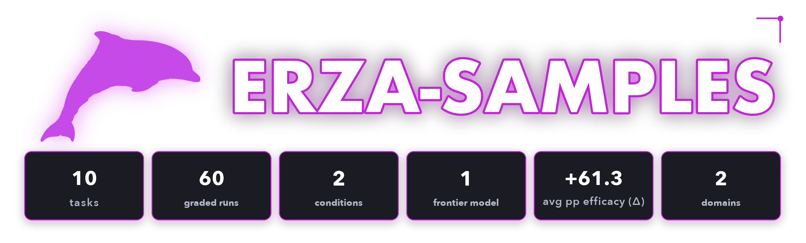
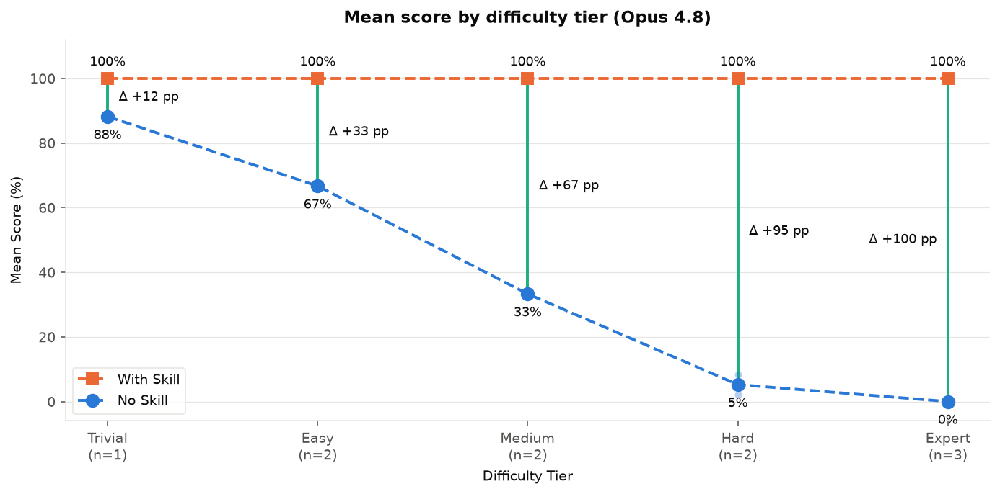
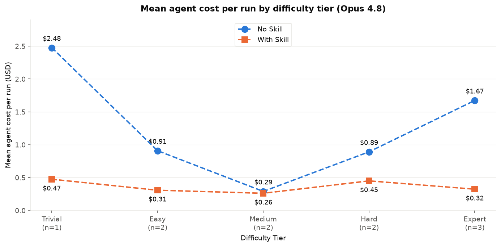
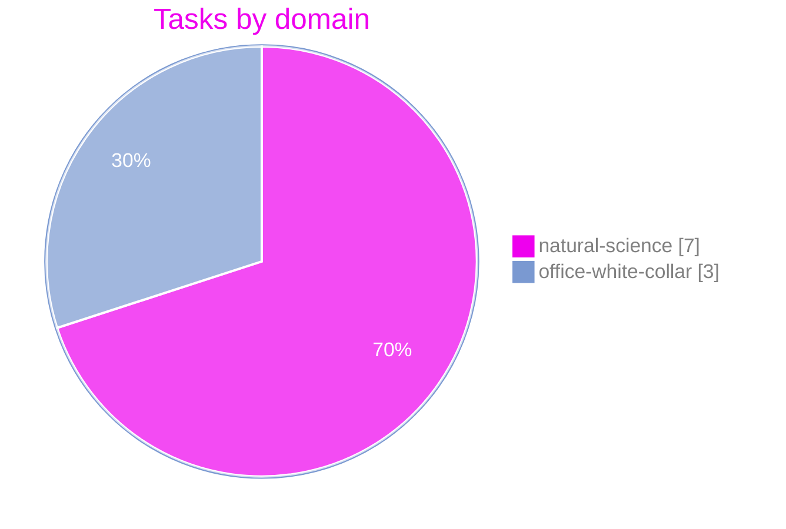
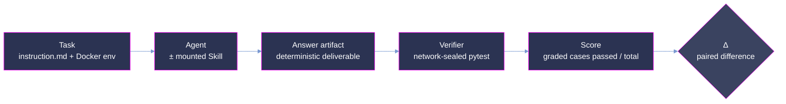

<p align="center">
  
</p>

<p align="center">
  <strong>Measuring whether a curated Skill changes what an agent can actually do, in paired runs.</strong>
</p>

<p align="center">
  <a href="#summary"></a>
  <a href="#scoring-methodology"></a>
  <a href="#scoring-methodology"></a>
  <a href="#verification-and-quality-assurance"></a>
</p>

<p align="center"><sub>
  <a href="#summary">Summary</a> · <a href="#repository-layout">Layout</a> · <a href="#difficulty-tiers">Tiers</a> · <a href="#results-skill-efficacy-vs-unaided-difficulty">Results</a> · <a href="#analysis">Analysis</a> · <a href="#coverage">Coverage</a> · <a href="#dataset-structure">Dataset</a> · <a href="#trajectory-structure">Trajectories</a> · <a href="#scoring-methodology">Scoring</a> · <a href="#reproduction">Reproduction</a> · <a href="#verification-and-quality-assurance">Verification</a>
</sub></p>

# Erza: 10-Task Agent-Skills Efficacy Sample

**Erza measures whether a curated Skill changes what an agent can actually do, not whether a model
is good at a domain.** Every task is run twice under identical conditions — same container, same
prompt, same verifier — differing only in whether a curated, domain-specific Skill is mounted.
Where capability benchmarks score a model against a task, Erza scores the *difference the Skill
makes* on the same task: the headline measurement is **Skill efficacy (Δ)**, a paired difference,
not an unpaired-pool comparison.

This is a curated **10-task** sample from Erza. Each task is a self-contained, containerized
domain-procedure problem, paired with the complete agent trajectories of one frontier model
(Claude Opus 4.8) under 2 conditions at 3 runs each, for 60 graded runs in total, each scored by
the Erza verifier.

Tasks are grouped into five difficulty tiers (Trivial, Easy, Medium, Hard, Expert), calibrated
from observed unaided difficulty on this sample, and cover 10 subcategories across 2 domains.

Skill efficacy grows as unaided difficulty rises, saturating at +100 pp on the Expert tier where
the unaided model scores zero. See
[Results](#results-skill-efficacy-vs-unaided-difficulty) for how the tiers are defined.



> **This is a quality-controlled orientation sample of the Erza corpus,** provided for evaluation.
> The dataset format, trajectory format, and scoring are identical to the production Erza harness.
> Three runs per arm cannot establish an efficacy estimate — see the limitations in
> [Verification](#verification-and-quality-assurance).

## Summary

| Property            | Value                                                                            |
| :------------------ | :------------------------------------------------------------------------------- |
| Tasks               | **10** (Trivial 1 / Easy 2 / Medium 2 / Hard 2 / Expert 3)                        |
| Difficulty tiers    | 5, by **observed unaided difficulty**                                             |
| Models evaluated    | Claude Opus 4.8 (`claude-opus-4-8`)                                               |
| Conditions          | no-Skills (A) · curated-Skills (B), single-variable pairing                       |
| Runs & grid         | 3 per condition (`run_1`/`run_2`/`run_3`) = 6 per task, 60 total; full 2 × 3, no gaps |
| Score               | graded cases passed / total per run, in [0, 1] (partial credit)                   |
| Domains             | 2 (natural-science 7 · office-white-collar 3)                                     |
| Subcategories       | 10 (one per task)                                                                 |

**Skill efficacy on this sample** (see [Scoring methodology](#scoring-methodology) for how Δ is
defined; the excluded-task column is explained in
[Verification](#verification-and-quality-assurance)):

| Metric                                 |     10 tasks | Excl. `48f28e86` |
| :------------------------------------- | -----------: | ---------------: |
| no-Skills mean score (A)               |    **0.299** |        **0.258** |
| curated-Skills mean score (B)          |    **1.000** |        **1.000** |
| **Skill efficacy (Δ = B − A)**         | **+70.1 pp** |     **+74.2 pp** |
| Normalized gain `g = Δ / (1 − A)`      |     **100%** |         **100%** |
| no-Skills pass rate (all cases passed) | 13.3% (4/30) |      7.4% (2/27) |
| curated-Skills pass rate               | 100% (30/30) |     100% (27/27) |

## Repository layout

```
erza-samples/
├── README.md                 # this document
├── assets/                   # figures
│   ├── score_by_tier.png     # + score_by_tier.py, its generator
│   └── cost_by_tier.png      # + cost_by_tier.py, its generator
└── dataset/                  # one self-contained directory per task-id (10)
    └── <task-id>/
        ├── task.toml instruction.md environment/ oracle/ tests/ ...
        └── trajectories/claude-opus-4-8/<condition>/run_N/ ...
```

`condition ∈ {no-skill, with-skill}`, `N ∈ {1, 2, 3}`. Unlike a split dataset/trajectories layout,
**each task directory is self-contained**: the bundle and every run that measures it live together,
so a task can be read, rebuilt and audited without reference to anything outside its own folder.

## Difficulty tiers

The 10 tasks are stratified into five tiers by observed difficulty on this sample: the unaided
(no-Skills) mean score A of each task, binned at fixed cut-points — Expert A = 0 exactly, Hard
0 < A < 0.3, Medium 0.3 ≤ A < 0.6, Easy 0.6 ≤ A < 0.8, Trivial A ≥ 0.8. Trivial tasks are largely
solved by the unaided model; Expert tasks never are. This is an **outcome-based** stratification,
computed from the runs shipped here, so the tiers describe what the model actually experienced
rather than any property fixed in advance (`task.toml` declares all 10 `hard`).


| Tier        |   n | mean A | mean Δ |
| :---------- | --: | -----: | -----: |
| **Trivial** |   1 |  0.882 | +0.118 |
| **Easy**    |   2 |  0.667 | +0.333 |
| **Medium**  |   2 |  0.333 | +0.667 |
| **Hard**    |   2 |  0.052 | +0.948 |
| **Expert**  |   3 |  0.000 | +1.000 |

## Results: skill efficacy vs unaided difficulty

The tier axis is the unaided score itself, so the no-Skills line in the figure above falls across
tiers *by construction*. The measured content is the curated line and the gap: the curated arm
scores 1.000 in every tier, so Δ equals the headroom the unaided model leaves — from +11.8 pp on
the Trivial tier to +100 pp on Expert.

Per-task figures are derivable directly from the shipped files: per-run scores from each run's
`verifier/pytest_output.txt` (graded cases only — see
[Scoring methodology](#scoring-methodology)), mirrored in `verifier/reward.txt` and
`result.json`.

**Per-tier pass rate by condition** (fraction of the arm's runs in the tier that passed every
graded case, score = 1.0):

| Tier (n)    | no-Skills | curated-Skills |
| :---------- | --------: | -------------: |
| Trivial (1) |      0.0% |         100.0% |
| Easy (2)    |     33.3% |         100.0% |
| Medium (2)  |     33.3% |         100.0% |
| Hard (2)    |      0.0% |         100.0% |
| Expert (3)  |      0.0% |         100.0% |

**Per-tier mean score by condition** (mean of graded-cases-passed / total across the arm's runs in
the tier, partial credit in [0, 1]):

| Tier (n)    | no-Skills | curated-Skills |      Δ |
| :---------- | --------: | -------------: | -----: |
| Trivial (1) |     88.2% |         100.0% |  +11.8 |
| Easy (2)    |     66.7% |         100.0% |  +33.3 |
| Medium (2)  |     33.3% |         100.0% |  +66.7 |
| Hard (2)    |      5.2% |         100.0% |  +94.8 |
| Expert (3)  |      0.0% |         100.0% | +100.0 |

**Per-task scores** (per-run score is graded cases passed / total; sorted by A):

| Task       | Cases | no-skill runs           |     **A** | with-skill | **Δ**      |
| :--------- | ----: | :---------------------- | --------: | :--------- | :--------- |
| `6f76812f` |    12 | 0.000 · 0.000 · 0.000   | **0.000** | 1.000 × 3  | **+1.000** |
| `c59f8b2a` |    12 | 0.000 · 0.000 · 0.000   | **0.000** | 1.000 × 3  | **+1.000** |
| `d427488f` |     2 | 0.000 · 0.000 · 0.000   | **0.000** | 1.000 × 3  | **+1.000** |
| `029f6a19` |    31 | 0.000 · 0.065 · 0.000   | **0.022** | 1.000 × 3  | **+0.978** |
| `e9474235` |    12 | 0.083 · 0.083 · 0.083   | **0.083** | 1.000 × 3  | **+0.917** |
| `446e76fe` |     1 | 0.000 · 0.000 · 1.000   | **0.333** | 1.000 × 3  | **+0.667** |
| `903d6f33` |    16 | 0.000 · 0.000 · 1.000   | **0.333** | 1.000 × 3  | **+0.667** |
| `20840ce0` |    31 | 0.774 · 0.452 · 0.774   | **0.667** | 1.000 × 3  | **+0.333** |
| `48f28e86` |    12 | 0.000 · 1.000 · 1.000   | **0.667** | 1.000 × 3  | **+0.333** |
| `c7faca71` |    51 | 0.843 · 0.863 · 0.941   | **0.882** | 1.000 × 3  | **+0.118** |

With 10 tasks across five tiers, these are an average tendency on a small, curated sample rather
than a precise law.

In contrast to accuracy, inference cost does not track difficulty — the unaided arm's cost tracks
how much output it burns re-deriving procedure, and is highest at *both* ends of the tier scale,
while the curated arm's cost stays flat.



## Analysis

**The Skill moves accuracy and cost in the same direction.** The curated arm scores 1.000 on every
one of the 30 curated runs while costing **3.4× less** per run ($0.348 vs $1.168). On nine of ten
tasks the no-Skills arm also emits far more output — `6f76812f` burns 95k output tokens and $3.18
per run to arrive at 0/12, and `c7faca71` spends $2.48 per run re-deriving duty-limit tables the
Skill simply contains. This is the signature of a Skill that supplies *procedure* rather than
capability: the unaided arm re-derives a house method it half-remembers, while the curated arm
reads the SOP and executes it. `903d6f33` is the one inversion, and it is the cheapest task in the
set either way.

**Pass rate captures how hard the tasks are, not what the Skill recovers.** The unaided arm's pass
rate is 13.3% while its mean score is 29.9% — pass rate hides partial progress. `c7faca71` scores
0.882 unaided but passes 0 of 3 unaided runs; a reader who took only pass figures away would call
it as unsolved as the Expert tier. Mean score keeps that progress visible, which is why every Δ in
this document is computed on mean score, not pass rate.

**Failures land on the documented levers.** The no-Skills failures are not random — they land on
the exact mistakes each SOP is designed to reject. `d427488f`'s unaided runs report `0.255886`, the
value a *mean* rather than *median* within-lab reduction produces. `446e76fe`'s land on `4.390`,
which the bundle identifies as the one-zero velocity-form Wood-Anderson path. `20840ce0`'s unaided
runs place the opening fields correctly and then drift at the reserved position runs the published
layout hides mid-record. Each failing run is a well-formed, confidently-wrong answer of the kind a
domain sanity-check waves through.

**The science tasks are near-binary; the office tasks carry real partial credit.** On the eight
natural-science tasks only 4 of 24 unaided runs score strictly between 0 and 1: each turns on a
single procedural decision applied to one computation, the verifiers require every named wrong path
to miss by **≥ 2× tolerance** (recorded per task as `control_gaps`), and so one wrong choice fails
every graded case together. The two office tasks behave differently — all 6 of their unaided runs
land strictly between 0 and 1, because their graded cases decompose into genuinely separable units
(field groups of a fixed-width record; per-pairing legality findings), and an unaided run gets some
units right. That contrast is why the tier figure can show a graded slope at the easy end while the
hard end is all-or-nothing.

These separations are trustworthy only because the scores cannot be gamed: grading is
network-sealed deterministic `pytest`, the agent never sees the oracle or the tests, and every
curated `SKILL.md` carries class-level procedure rather than answers — see
[Verification](#verification-and-quality-assurance).

## Coverage

| Domain              | Tasks |     | Domain              | Tasks |
| :------------------ | ----: | :-- | :------------------ | ----: |
| natural-science     |     7 |     | office-white-collar |     3 |

**10 subcategories, one per task**: ionospheric-physics, geodesy, metrology, oceanography,
seismology, astronomy, geomagnetism (natural-science); official-population-statistics,
tax-information-reporting, aviation-regulatory-compliance (office-white-collar). Each task bundles
a domain-specific house procedure the agent must execute exactly, and a plausible decoy in the
inputs that a competent but unaided run tends to fall into.


```mermaid
%%{init: {'theme':'base','themeVariables':{'primaryTextColor':'#ffffff','pieStrokeColor':'#ffffff','pieStrokeWidth':'2px','pieOuterStrokeColor':'#7a99d1','pieTitleTextColor':'#ee00ee','pieSectionTextColor':'#ffffff','pieLegendTextColor':'#808080','pie1':'#ee00ee','pie2':'#7a99d1','fontFamily':'DM Sans, Roboto, Segoe UI, sans-serif'}}}%%
pie showData title Tasks by domain
  "natural-science" : 7
  "office-white-collar" : 3
```

## Dataset structure

Each task lives under `dataset/<task-id>/` and is fully self-contained:

```
dataset/<task-id>/
├── task.toml                 # metadata, resource + network policy, reward family
├── instruction.md            # the prompt presented to the agent
├── uuid_provenance.json      # content-addressed integrity manifest (sha256 per file)
├── graded_cases.json         # which tests are graded and which are guards
├── TRUTH.md                  # answer-free golden procedure (grader-side)
├── environment/
│   ├── Dockerfile            # pinned sandbox
│   ├── data/                 # inputs mounted at /root/data
│   └── skills/               # mounted ONLY in the curated-Skills arm
├── oracle/                   # deterministic generator + reference solution; never mounted
└── tests/
    ├── test.sh               # entry point; pre-seeds reward 0, parses JUnit XML
    ├── test_pytest.py        # outcome assertions + guards + process rubric
    ├── expected_values.json  # references, tolerances, and the control ledger
    └── rubrics.json judge.py # process-channel criteria
```

During a run the agent sees only the built environment, the `instruction.md` prompt body, and — in
the curated arm — the mounted Skills directory. `oracle/`, `TRUTH.md` and `tests/` are used
exclusively by the verifier and are never exposed to the agent. The **graded set** the run is
scored on is the outcome cases in `tests/test_pytest.py`; the **guards** (plausibility,
isomorphic-invariance, frozen-golden recompute) check the grader itself and never enter the score.

## Trajectory structure

Each run lives under `dataset/<task-id>/trajectories/claude-opus-4-8/<condition>/run_N/`:

```
trajectories/claude-opus-4-8/<condition>/run_N/   # condition ∈ {no-skill, with-skill}; N ∈ {1,2,3}
├── result.json            # config, agent metrics, reward, timing, task_digest
├── config.json prompts.json timing.json rewards.jsonl
├── agent/                 # ACP event stream, install log
├── trajectory/            # canonical ACP trace + raw LLM turns
├── trainer/               # trainer-format records (adp/atif/verifiers)
└── verifier/
    ├── reward.txt pass_at_1.txt      # scalars
    ├── results.xml pytest_output.txt # structured + raw grader output
    ├── test-stdout.txt               # header + tail
    └── process/                      # process-channel panel and scores
```

Key `result.json` fields: `rewards.reward` (the run's score, agrees with `verifier/reward.txt` on
all 60 runs), `task_digest` (the frozen-bundle-bytes binding; one digest per task cohort),
`agent_result` (token usage, `cost_usd`, `n_tool_calls`), and `config` (uniform
`agent.timeout_sec = 1800`). The raw graded record is `verifier/pytest_output.txt` — the
authoritative scoring source. Do not use `agent_result.n_skill_invocations` (always 0, a known
defect); Skill usage is evidenced in `trajectory/acp_trajectory.jsonl`.

## Scoring methodology


```mermaid
%%{init: {'theme':'base','themeVariables':{'primaryColor':'#2b3352','primaryTextColor':'#ffffff','primaryBorderColor':'#7a99d1','lineColor':'#7a99d1','fontFamily':'DM Sans, Roboto, Segoe UI, sans-serif'}}}%%
flowchart LR
  A["Task<br/>instruction.md + Docker env"] --> B["Agent<br/>± mounted Skill"]
  B --> C["Answer artifact<br/>deterministic deliverable"]
  C --> D["Verifier<br/>network-sealed pytest"]
  D --> E["Score<br/>graded cases passed / total"]
  E --> F{"Δ<br/>paired difference"}
  classDef sealed fill:#2b3352,stroke:#ee00ee,color:#ffffff;
  classDef node fill:#2b3352,stroke:#ee00ee,color:#ffffff;
  classDef gate fill:#3a4360,stroke:#ee00ee,color:#ffffff;
  class A,B,C,E node;
  class D sealed;
  class F gate;
```

Because both conditions run the **same** task in the **same** container from a byte-identical
prompt, Δ is a paired difference at the (task, condition) level:

```
per-run score:    r = graded cases passed / graded cases total
per-task score:   s_{t,c} = mean over 3 runs of r
condition mean:   Score(c) = (1/10) Σ_t s_{t,c}
efficacy:         Δ = Score(curated) − Score(no-Skills)
normalized gain:  g = Δ / (1 − Score(no-Skills))
```

Grading is deterministic `pytest` inside the sealed container — **no LLM-as-judge in the reward
path**. Each `tests/test.sh` pre-seeds the reward artifacts to 0 (a crash grades 0, never a missing
file), parses the score from the JUnit XML report rather than scanning text, identifies scored
tests by an explicit name prefix, and excludes grader self-checks from the denominator. A failing
self-check trips a kill-switch: the run is a bundle defect, not an agent failure. Every task also
ships **anti-shortcut guards**, unscored but blocking; nine of the ten tasks assert isomorphic
invariance — the reference is recomputed on a relabelled, reordered instance and asserted
unchanged, so a run cannot pass by keying on instance-specific names or positions.

Tasks run `network_mode: no-network`, so the image bakes in `pytest` and the agent cannot look the
answer up. Every task ships a human-authored reference solution (`oracle/`) that passes by
construction, guaranteeing the grader is self-consistent; it is **not** an independent measure of
real-world solvability.

## Reproduction

Image-building, agent execution, and scoring are orchestrated by the **Erza harness**. The score
for every run is in `verifier/reward.txt` and `result.json` (`rewards.reward`), with the raw graded
record in `verifier/pytest_output.txt`. The figures regenerate from `assets/score_by_tier.py` and
`assets/cost_by_tier.py` (`uv run --with matplotlib python3 assets/score_by_tier.py`).

### Recompute the efficacy yourself

No trajectory re-execution is needed. Read the shipped grader records directly:

```python
import glob, json, os, re, collections

GUARD = re.compile(r'plausib|isomorphic|invarian|guess_resist|frozen_golden|frozen_reference'
                   r'|tolerances_are|load_bearing|not_the_|wood_anderson_calib|golden_matches')
scores = collections.defaultdict(lambda: collections.defaultdict(list))

for run in glob.glob("dataset/*/trajectories/*/*/run_*"):
    task, cond = run.split("/")[1], run.split("/")[-2]
    spec = json.load(open(f"dataset/{task}/graded_cases.json"))["graded_tests"] \
        if os.path.exists(f"dataset/{task}/graded_cases.json") else None
    status = dict(re.findall(r'^(?:\S*::)?(\S+)\s+(PASSED|FAILED|ERROR|SKIPPED)\b',
                             open(f"{run}/verifier/pytest_output.txt", errors="ignore").read(), re.M))
    graded = {k for k in status
              if (k in {t.lstrip(':') for t in spec} if spec else k.startswith("test_graded_case"))
              and not GUARD.search(k)}
    scores[task][cond].append(sum(status[k] == "PASSED" for k in graded) / len(graded))

per_task = {t: {c: sum(v) / len(v) for c, v in arms.items()} for t, arms in scores.items()}
paired = [s for s in per_task.values() if "with-skill" in s]
A = sum(s["no-skill"] for s in paired) / len(paired)
B = sum(s["with-skill"] for s in paired) / len(paired)
print(f"A = {A:.3f}  B = {B:.3f}  delta = {B - A:+.3f}  g = {(B - A) / (1 - A):.3f}")
# -> A = 0.299  B = 1.000  delta = +0.701  g = 1.000   (over all 10 paired tasks)
```

The score is read from the **raw pytest record**, not from the `test cases passed` header in
`test-stdout.txt` — one shipped header disagrees with its own record (see
[Verification](#verification-and-quality-assurance)).

## Verification and quality assurance

This sample passed a QC gate prior to delivery:

- **Structure.** 10 self-contained task directories, each carrying a complete 2 × 3 grid (60 runs);
  every scoring-relevant file present and non-empty in every run.
- **Provenance.** Every bundle carries a `uuid_provenance.json` sha256 manifest; every listed file
  matches it and the canonical hash re-verifies on all 10 bundles. Three bundles (`029f6a19`,
  `20840ce0`, `c7faca71`) were re-sealed 2026-08-04 after standardisation to the common layout;
  their run grids are byte-identical to their upstream Erza delivery source.
- **Score integrity.** Every score is recomputed from the run's own raw pytest record;
  `verifier/reward.txt` agrees with `result.json` and `pass_at_1.txt` on all 60 runs.
- **Paired isolation.** `prompts.json` is byte-identical across both arms on all 10 tasks — the
  Skill is delivered by filesystem mount, never by prompt injection. Agent budgets are uniform
  (1800 s) across both arms on nine tasks, and each task's runs share a single `task_digest`, so
  both arms measured the same frozen bundle bytes. The two arms differ in exactly one variable.
- **The Skill was genuinely used.** All 30 curated runs record an explicit launch of their task's
  Skill in `trajectory/acp_trajectory.jsonl`; all 30 no-Skills runs record none.
- **Fair play.** The agent is never given the oracle, `TRUTH.md`, or the grading tests; these are
  mounted only for the verifier (`network_mode: no-network`). Each curated `SKILL.md` is
  class-level procedure — the reduction rule, the house constants, the uncertainty definitions —
  not an answer key.
- **Anti-memorization.** Nine of ten tasks assert isomorphic invariance under relabelling and
  reordering; tolerances are engineered, with the separation from each named wrong path recorded
  per task as `control_gaps`.
- **Known defects.** Shipped and documented rather than silently fixed:
  - `48f28e86` no-skill/run_1's `test-stdout.txt` header reads `2/12` but its own pytest record
    shows 0/12 — the header counted two guards into a graded denominator. `reward.txt`,
    `pass_at_1.txt` and `result.json` all correctly read 0; this is the only such disagreement in
    all 60 runs. Score from the pytest record, not the header.
  - `48f28e86` is a **screening bundle**: its own `trajectories/PROVENANCE.md` states its runs are
    not a valid paired comparison (agent budgets differ across runs, 700/900/1200 s), so **no Δ
    should be quoted from it** — the excluded-task column in [Summary](#summary) is the honest one.
  - `20840ce0` and `c7faca71` sit high unaided (A = 0.667, 0.882): the model largely solves both
    without the Skill, and their Δ are the smallest in the sample. They are shipped because their
    pairing is clean and they carry the sample's only real partial credit. Their grids replaced a
    superseded 2026-07-29 single-run generation; neither ships `egress/probe.txt` (the capture
    does not exist for this cohort in any source).
  - `029f6a19` ships `run_1..3` of each arm from a larger source set (first three by index, not
    selected on score; the omitted no-Skills runs score 0.000 and 0.065).
  - `agent_result.n_skill_invocations` is 0 on every run including curated ones — use the
    trajectory. `agent/claude_agent_acp.txt` is empty in a subset of runs; full behaviour is in
    `trajectory/`. `d427488f`'s verifier artifacts were re-serialised from an older CTRF harness
    (no score changed) and it ships no `egress/probe.txt`. `graded_cases.json` on the seven older
    tasks is name-pattern derived and self-flags `needs_review: true`; on the three newer tasks it
    is exact.
- **Limitations.**
  - **Sample size.** 10 tasks, 3 runs per arm, one model; the Erza delivery standard is ≥ 5 trials
    per arm with paired-bootstrap confidence intervals, so this sample demonstrates format and
    method and is not a powered efficacy estimate. Per-tier figures are averages on n of 1–3 tasks.
  - **Circularity of the tier axis.** Tiers are binned on the unaided score, so the no-Skills
    slope across tiers is true by construction; only the curated line and Δ are findings.
  - **Little score variance.** All 30 curated runs score exactly 1.000 and 20 of 30 unaided runs
    score exactly 0 or 1; partial credit is concentrated in the two office tasks.
  - **Selection.** Tasks were drawn from an existing measured pool, and every task here has
    positive Δ; Erza's charter keeps and labels zero- and negative-Δ tasks, none of which are
    represented, so this sample is not evidence about the Δ distribution.
  - **Model nondeterminism.** The same model produces different outputs for the same task; the
    unaided arm's differing answers at identical scores are themselves evidence of that.

## License

`cc-by-nc-nd-4.0`. Each bundled `SKILL.md` carries its own header.
