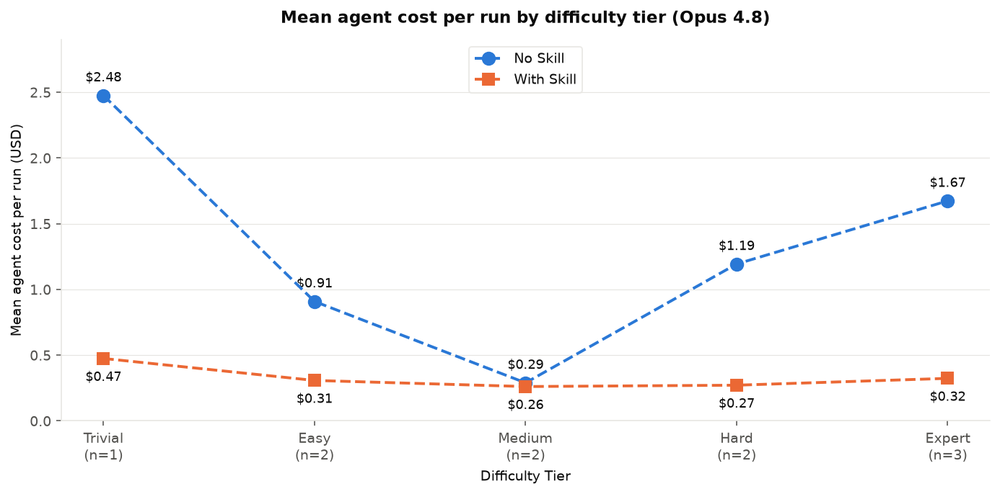
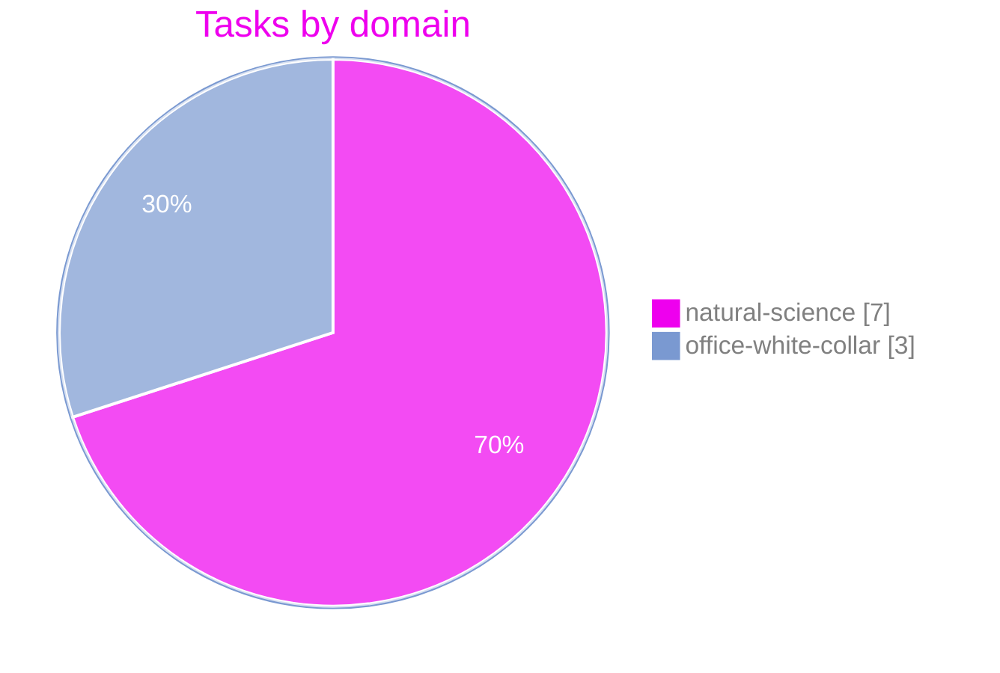
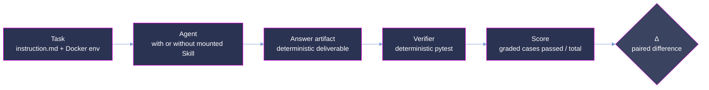

<p align="center">
  
</p>

<p align="center">
  <strong>Measuring whether a curated Skill changes what an agent can do, in paired runs.</strong>
</p>

<p align="center">
  <a href="#summary"></a>
  <a href="#scoring-methodology"></a>
  <a href="#scoring-methodology"></a>
  <a href="#difficulty-tiers"></a>
</p>

<p align="center"><sub>
  <a href="#summary">Summary</a> | <a href="#repository-layout">Layout</a> | <a href="#difficulty-tiers">Tiers</a> | <a href="#results-skill-efficacy-vs-unaided-difficulty">Results</a> | <a href="#analysis">Analysis</a> | <a href="#coverage">Coverage</a> | <a href="#dataset-structure">Dataset</a> | <a href="#trajectory-structure">Trajectories</a> | <a href="#scoring-methodology">Scoring</a> | <a href="#reproduction">Reproduction</a> | <a href="#verification-and-quality-assurance">Verification</a> | <a href="#limitations-and-next-work">Limitations</a>
</sub></p>

# Erza: 10-Task Agent-Skills Efficacy Sample

Erza measures whether a curated Skill changes what an agent can do, rather than whether a model is good at a domain. Every task runs twice under matched conditions: same container, same prompt, same verifier, differing only in whether a curated domain Skill is mounted on the filesystem. Where a capability benchmark scores a model against a task, Erza scores the difference the Skill makes on that same task. The headline quantity is Skill efficacy, written Δ, and it is a paired difference computed within each task before any averaging.

This is a curated 10-task sample from Erza. Each task is a self-contained, containerized domain-procedure problem, paired with the complete agent trajectories of one frontier model (Claude Opus 4.8) under 2 conditions at 3 runs each, for 60 graded runs in total, each scored by the Erza verifier.

Tasks are grouped into five difficulty tiers (Trivial, Easy, Medium, Hard, Expert), calibrated from observed unaided difficulty on this sample, and cover 10 subcategories across 2 domains.

The curated arm scores 1.000 on every task here, so Δ is set by whatever the unaided arm leaves on the table, reaching +100 pp on the Expert tier where the unaided model scores nothing at all. See [Results](#results-skill-efficacy-vs-unaided-difficulty) for how the tiers are defined and why their slope is not itself a finding.


> This is a quality-controlled orientation sample of the Erza corpus, provided for evaluation. The dataset format, trajectory format, and scoring are identical to the production Erza harness. Three runs per arm cannot establish an efficacy estimate, and three of the ten tasks carry pairing defects recorded in their own shipped provenance. See [Limitations and next work](#limitations-and-next-work) before quoting any figure here.

## Summary

| Property            | Value                                                                                |
| :------------------ | :----------------------------------------------------------------------------------- |
| Tasks               | 10 (Trivial 1 / Easy 2 / Medium 2 / Hard 2 / Expert 3)                                |
| Difficulty tiers    | 5, by observed unaided difficulty                                                     |
| Models evaluated    | Claude Opus 4.8 (`claude-opus-4-8`)                                                   |
| Conditions          | no-Skills (A) and curated-Skills (B), single-variable pairing                          |
| Runs & grid         | 3 per condition (`run_1`/`run_2`/`run_3`) = 6 per task, 60 total; full 2 x 3, no gaps  |
| Score               | graded cases passed / total per run, in [0, 1] (partial credit)                        |
| Domains             | 2 (natural-science 7, office-white-collar 3)                                           |
| Subcategories       | 10 (one per task)                                                                      |
| Clean-pairing subset | 7 tasks (see [Verification](#verification-and-quality-assurance))                      |

Skill efficacy is reported over three task sets. The first covers everything shipped. The second drops `48f28e86`, whose agent budgets vary run to run. The third keeps only the seven tasks whose pairing survives every integrity check, and it is the column to quote when a single number is needed.

| Metric                                 |     10 tasks | Excl. `48f28e86` | Clean-pairing 7 |
| :------------------------------------- | -----------: | ---------------: | --------------: |
| no-Skills mean score (A)               |        0.299 |            0.258 |           0.272 |
| curated-Skills mean score (B)          |        1.000 |            1.000 |           1.000 |
| Skill efficacy (Δ = B - A)             |    +70.1 pp  |        +74.2 pp  |       +72.8 pp  |
| Normalised gain `g = Δ / (1 - A)`      |         100% |             100% |            100% |
| no-Skills pass rate (all cases passed) | 13.3% (4/30) |      7.4% (2/27) |     4.8% (1/21) |
| curated-Skills pass rate               | 100% (30/30) |     100% (27/27) |    100% (21/21) |

The three columns span 4.1 pp, so the headline does not depend on which defensible task set a reader picks. That stability is the point of showing all three.

## Repository layout

```
erza-samples/
├── README.md                 # this document
├── images/                   # figures and their generators
│   ├── score_by_tier.png     # with score_by_tier.py
│   └── cost_by_tier.png      # with cost_by_tier.py
└── <task-id>/                # one self-contained directory per task-id (10)
    ├── task.toml instruction.md environment/ oracle/ tests/ ...
    └── trajectories/claude-opus-4-8/<condition>/run_N/ ...
```

Conditions are `no-skill` and `with-skill`; `N` runs 1 to 3. Unlike a split dataset/trajectories layout, each task directory is self-contained: the bundle and every run that measures it live together, so a task can be read, rebuilt and audited without reference to anything outside its own folder.

## Difficulty tiers

The 10 tasks are stratified into five tiers by observed difficulty on this sample: the unaided (no-Skills) mean score A of each task, binned at fixed cut-points. Expert is A = 0 exactly, Hard is 0 < A < 0.3, Medium is 0.3 <= A < 0.6, Easy is 0.6 <= A < 0.8, and Trivial is A >= 0.8. Trivial tasks are largely solved by the unaided model; Expert tasks never are. This is an outcome-based stratification, computed from the runs shipped here, so the tiers describe what the model met rather than any property fixed in advance. Every `task.toml` declares `difficulty = "hard"` while observed A spans 0.000 to 0.882, which is why the declared field is not used for the axis. The figure above plots these tiers.

| Tier        |   n | Tasks                                | mean A | mean Δ |
| :---------- | --: | :----------------------------------- | -----: | -----: |
| Trivial     |   1 | `c7faca71`                           |  0.882 | +0.118 |
| Easy        |   2 | `20840ce0`, `48f28e86`               |  0.667 | +0.333 |
| Medium      |   2 | `446e76fe`, `903d6f33`               |  0.333 | +0.667 |
| Hard        |   2 | `029f6a19`, `e9474235`               |  0.052 | +0.948 |
| Expert      |   3 | `6f76812f`, `c59f8b2a`, `d427488f`   |  0.000 | +1.000 |

## Results: skill efficacy vs unaided difficulty

The tier axis is the unaided score itself, so the no-Skills line in the figure above falls across tiers by construction. The measured content is the curated line and the gap: the curated arm scores 1.000 in every tier, so Δ equals the headroom the unaided model leaves, from +11.8 pp on the Trivial tier to +100 pp on Expert.

Per-task figures are derivable directly from the shipped files: per-run scores from each run's `verifier/process.json`, whose `outcome` block separates the graded `cases` from the grader's own `selfchecks`, mirrored in `verifier/score.md` and `result.json`.

Per-tier pass rate by condition (fraction of the arm's runs in the tier that passed every graded case, score = 1.0):

| Tier (n)    |   no-Skills | curated-Skills |
| :---------- | ----------: | -------------: |
| Trivial (1) |  0.0% (0/3) |   100.0% (3/3) |
| Easy (2)    | 33.3% (2/6) |   100.0% (6/6) |
| Medium (2)  | 33.3% (2/6) |   100.0% (6/6) |
| Hard (2)    |  0.0% (0/6) |   100.0% (6/6) |
| Expert (3)  |  0.0% (0/9) |   100.0% (9/9) |

Per-tier mean score by condition (mean of graded-cases-passed / total across the arm's runs in the tier, partial credit in [0, 1]):

| Tier (n)    | no-Skills | curated-Skills |      Δ |
| :---------- | --------: | -------------: | -----: |
| Trivial (1) |     88.2% |         100.0% |  +11.8 |
| Easy (2)    |     66.7% |         100.0% |  +33.3 |
| Medium (2)  |     33.3% |         100.0% |  +66.7 |
| Hard (2)    |      5.2% |         100.0% |  +94.8 |
| Expert (3)  |      0.0% |         100.0% | +100.0 |

Per-task scores (per-run score is graded cases passed / total; sorted by A). The Pairing column records what the [Verification](#verification-and-quality-assurance) checks found, and the three flagged rows should not be read as measurements of skill efficacy on their own:

| Task       | Cases | no-skill runs           |     A | with-skill |      Δ | Pairing        |
| :--------- | ----: | :---------------------- | ----: | :--------- | -----: | :------------- |
| `6f76812f` |    12 | 0.000, 0.000, 0.000     | 0.000 | 1.000 x 3  | +1.000 | clean          |
| `c59f8b2a` |    12 | 0.000, 0.000, 0.000     | 0.000 | 1.000 x 3  | +1.000 | clean          |
| `d427488f` |     2 | 0.000, 0.000, 0.000     | 0.000 | 1.000 x 3  | +1.000 | clean          |
| `029f6a19` |    31 | 0.000, 0.065, 0.000     | 0.022 | 1.000 x 3  | +0.978 | clean          |
| `e9474235` |    12 | 0.083, 0.083, 0.083     | 0.083 | 1.000 x 3  | +0.917 | budgets differ |
| `446e76fe` |     1 | 0.000, 0.000, 1.000     | 0.333 | 1.000 x 3  | +0.667 | clean          |
| `903d6f33` |    16 | 0.000, 0.000, 1.000     | 0.333 | 1.000 x 3  | +0.667 | digests differ |
| `20840ce0` |    31 | 0.774, 0.452, 0.774     | 0.667 | 1.000 x 3  | +0.333 | clean          |
| `48f28e86` |    12 | 0.000, 1.000, 1.000     | 0.667 | 1.000 x 3  | +0.333 | budgets differ |
| `c7faca71` |    51 | 0.843, 0.863, 0.941     | 0.882 | 1.000 x 3  | +0.118 | clean          |

With 10 tasks across five tiers, these are an average tendency on a small, curated sample rather than a precise law.

Alongside the graded outcome, every run carries a process channel in `verifier/process.json`. It grades how the answer was reached rather than whether it was right, combining an outcome channel, a deterministic channel and a judged channel by weight mass, and it never enters the score. A run that fails a crux or outcome gate has its process score capped at 0.500, so any unaided figure at that value is a ceiling rather than a graded quantity. No bundle ships a stored composite; each figure below is recomputed by that bundle's own `tests/score.py` from the run's recorded channels. `029f6a19`, `20840ce0` and `c7faca71` recorded a judged panel but no deterministic channel at all, so no composite can be formed for them and they are absent from this table:

| Task       | no-skill runs           |     A | with-skill runs         |     B |      Δ |
| :--------- | :---------------------- | ----: | :---------------------- | ----: | -----: |
| `e9474235` | 0.378, 0.400, 0.400     | 0.393 | 1.000, 1.000, 1.000     | 1.000 | +0.607 |
| `6f76812f` | 0.500, 0.500, 0.500     | 0.500 | 0.948, 1.000, 1.000     | 0.983 | +0.483 |
| `c59f8b2a` | 0.500, 0.500, 0.500     | 0.500 | 0.975, 0.975, 0.950     | 0.967 | +0.467 |
| `d427488f` | 0.500, 0.500, 0.500     | 0.500 | 0.930, 0.930, 0.930     | 0.930 | +0.430 |
| `903d6f33` | 0.500, 0.500, 0.738     | 0.579 | 0.938, 0.938, 0.938     | 0.938 | +0.359 |
| `446e76fe` | 0.500, 0.500, 0.959     | 0.653 | 0.980, 0.980, 0.980     | 0.980 | +0.327 |
| `48f28e86` | 0.500, 0.500, 1.000     | 0.667 | 1.000, 1.000, 1.000     | 1.000 | +0.333 |
| **Mean**   |                         | **0.542** |                     | **0.971** | **+0.429** |

**Read this table as provisional.** Only the `e9474235` row is computed on its full rubric. A per-criterion coverage audit against every archived run found that no other bundle recorded a verdict for its first two criteria, R1 and R2 — and **R2 is the gate**, the criterion that separates the arms — so each remaining row was computed without it. Four bundles additionally dropped a third criterion (`446e76fe` R14, `48f28e86` R12, `6f76812f` R13, `c59f8b2a` R12), in every case the last-defined detector in the module, which points at a truncation in whatever produced the reports. The three absent tasks are worse still: 14 to 16 of their 18 to 21 criteria, the whole deterministic channel including their gate, were never evaluated.

Each run's `process.json` names its own unevaluated criteria in `criteria_without_verdict`, and no missing verdict was reconstructed or inferred. Until the process channel is re-run across the grid, these figures should not be quoted as measurements; the graded outcome above is unaffected, being computed from a separate and complete record.

In contrast to accuracy, inference cost does not track difficulty. The unaided arm spends $1.168 per run against $0.348 for the curated arm, a ratio of 3.35x, while emitting 32,598 output tokens against 5,291 and making 10.3 tool calls against 6.6. Against the tier axis the two arms separate everywhere except Medium, where they nearly meet.



Unaided cost is highest at both ends of the tier scale, $2.476 per run on Trivial and $1.674 on Expert against $0.290 on Medium, because the spend reflects how much output the arm burns re-deriving procedure rather than how hard the task is. The curated arm holds between $0.261 and $0.475 across all five tiers: reading a written procedure costs about the same whatever the tier. Per task the unaided arm ranges from $0.136 to $3.179 while the curated arm ranges from $0.139 to $0.571.

## Analysis

The Skill moves accuracy and cost in the same favourable direction on nine of the ten tasks. `6f76812f` burns 95,494 output tokens and $3.179 per unaided run to arrive at 0 of 12 graded cases, against 7,737 tokens and $0.490 aided. `c7faca71` spends $2.476 per unaided run re-deriving duty-limit tables that the Skill simply contains. This is the signature of a Skill supplying procedure rather than capability: the unaided arm reconstructs a house method it half-remembers, while the curated arm reads the written procedure and executes it. The single inversion is `903d6f33`, at $0.136 unaided against $0.295 aided, and it is the cheapest task in the set under either condition.

Pass rate and mean score tell different stories, and only one of them is usable. Across all 10 tasks the unaided arm passes 13.3% of runs outright while its mean score is 29.9%, because pass rate discards partial progress. `c7faca71` scores 0.882 unaided yet passes none of its three unaided runs, so a reader working from pass rates alone would file it beside the Expert tier where the model scores nothing at all. Every Δ in this document is therefore computed on mean score.

Unaided failures land on the levers each procedure documents. In `d427488f` the unaided runs report `0.255886`, the value produced by taking a mean rather than a median within-lab reduction. In `446e76fe` they land on `4.390`, which the bundle identifies as the one-zero velocity-form Wood-Anderson path. In `20840ce0` they place the opening fields correctly and then drift at the reserved position that the published layout hides mid-record. Each failing run is a well-formed and confidently wrong answer of the kind a domain sanity-check waves straight through.

Only 3 of the 21 unaided runs on natural-science tasks land strictly between 0 and 1, and all three come from one task, `e9474235`. The other six science tasks return 0.000 or 1.000 on every unaided run, because each turns on a single procedural decision applied to one computation, so a wrong choice fails every graded case together. The three office tasks behave differently: 7 of their 9 unaided runs land strictly inside the interval, since their graded cases decompose into separable units, the field groups of a fixed-width record and the per-pairing legality findings, and an unaided run gets some of those units right. That contrast is why the tier figure shows a graded slope at the easy end and an all-or-nothing cliff at the hard end.

The process score shows that the unaided arm is not flailing. On the seven tasks carrying that channel its process Δ is +0.412, well short of the +0.798 outcome Δ those same seven tasks produce, and the gap is the interesting part. All 21 curated runs return a verdict of `ok` and score between 0.857 and 1.000. Of the 21 unaided runs, 17 carry a failed gate and 15 sit exactly at the 0.500 cap that a failed crux or outcome gate imposes, which means their underlying weighted score was clipped down to that value rather than earned at it. `6f76812f` run_1 is the shape of the whole arm: a deterministic channel of 0.814 and a judged channel of 0.143, an outcome of 0.375, capped to 0.500. Read together with the failure modes above, the picture is of runs executing recognisable procedure competently down a branch the house method rejects, which is why a domain reviewer skimming the work would not catch them.

Read the panel's own disclosure before using any of those numbers. Each of the 42 panels seats three models under assigned stances, `claude-opus-5` as domain reviewer, `claude-sonnet-5` as neutral and `claude-haiku-4-5-20251001` as sceptic, and every panel records `single_vendor_panel: true`, because all three come from the same vendor as the model under test. No seat grades itself, `self_judging_seats` being empty on all 42, but `family_judging_seats` lists `claude-opus-5`, so one seat shares a family with the graded `claude-opus-4-8` and carries an unmeasured leniency toward it. The seats do disagree: across 186 judged criteria 150 resolved unanimously and 36 by majority, so roughly a fifth carried real dissent rather than a rubber stamp. Each run is judged by one panel, so within-run stability is unmeasured. Every score is stamped with hashes of `TRUTH.md`, `rubrics.json` and the test file, one stamp per task across its six runs; stamps differ between tasks, which makes the per-task rows sound and the mean across them the weaker figure.

These separations hold only because the scores resist gaming. Grading is deterministic `pytest`, the agent never sees the oracle or the tests, and every curated `SKILL.md` carries class-level procedure instead of answers. The evidence for each of those claims is listed in [Verification](#verification-and-quality-assurance).

## Coverage

| Domain              | Tasks |     | Domain              | Tasks |
| :------------------ | ----: | :-- | :------------------ | ----: |
| natural-science     |     7 |     | office-white-collar |     3 |

10 subcategories, one per task: astronomy, geodesy, geomagnetism, ionospheric-physics, metrology, oceanography, seismology (natural-science); aviation-regulatory-compliance, official-population-statistics, tax-information-reporting (office-white-collar). Each task bundles a domain-specific house procedure the agent must execute exactly, and a plausible decoy in the inputs that a competent but unaided run tends to fall into.


```mermaid
%%{init: {'theme':'base','themeVariables':{'primaryTextColor':'#ffffff','pieStrokeColor':'#ffffff','pieStrokeWidth':'2px','pieOuterStrokeColor':'#7a99d1','pieTitleTextColor':'#ee00ee','pieSectionTextColor':'#ffffff','pieLegendTextColor':'#808080','pie1':'#ee00ee','pie2':'#7a99d1','fontFamily':'DM Sans, Roboto, Segoe UI, sans-serif'}}}%%
pie showData title Tasks by domain
  "natural-science" : 7
  "office-white-collar" : 3
```

## Dataset structure

Each task lives under `<task-id>/` at the repository root and is fully self-contained:

```
<task-id>/
├── task.toml                 # metadata, resource + network policy, score family
├── instruction.md            # the prompt presented to the agent
├── TRUTH.md                  # answer-free golden procedure (grader-side)
├── environment/
│   ├── Dockerfile            # pinned sandbox
│   ├── data/                 # inputs mounted at /root/data
│   └── skills/               # mounted ONLY in the curated-Skills arm
├── oracle/                   # deterministic generator + reference solution; never mounted
└── tests/
    ├── test.sh               # entry point; pre-seeds the score to 0, emits process.json
    ├── test_output.py        # outcome assertions (test_score_*) + guards (test_selfcheck_*)
    ├── score.py judge.py     # process-channel scorer and judge
    ├── rubrics.json          # per-criterion weights and channels
    └── expected_values.json  # references, tolerances, and the control ledger
```

During a run the agent sees only the built environment, the `instruction.md` prompt body, and, in the curated arm, the mounted Skills directory. The `oracle/`, `TRUTH.md` and `tests/` trees are used exclusively by the verifier and are never exposed to the agent. The graded set the run is scored on is the outcome cases; the guards (plausibility, isomorphic-invariance, frozen-golden recompute) check the grader itself and never enter the score.

All ten bundles share one layout. `tests/` is flat, with no subdirectories: `test_output.py` holds the outcome assertions and the guards, alongside `test.sh`, `score.py`, `judge.py`, `rubrics.json`, `expected_values.json` and the grader's own copies of any reference data. Graded tests carry the `test_score_` prefix and unscored guards carry `test_selfcheck_`, and that prefix pair is the scoring contract — `test.sh` and `score.py` read the same one. Each `rubrics.json` carries only the seven per-criterion fields the grader reads (`id`, `channel`, `weight`, `is_positive`, `is_gate`, `criterion`, `truth_ref`); the weight-justification prose lives in `rubric-evidence/<task_id>.md` at the repository root, so no shipped artifact cites a file that was never published. No bundle ships a content-hash seal, a `graded_cases.json`, or any compiled Python.

This layout is the result of a migration from two earlier generations, applied to every bundle. It re-serialised records without re-grading: all 60 runs' scores are byte-identical to their pre-migration values.

## Trajectory structure

Each run lives under `<task-id>/trajectories/claude-opus-4-8/<condition>/run_N/`:

```
trajectories/claude-opus-4-8/<condition>/run_N/   # condition ∈ {no-skill, with-skill}; N ∈ {1,2,3}
├── result.json            # config, agent metrics, score, timing, task_digest
├── config.json prompts.json timing.json scores.jsonl
├── agent/                 # ACP event stream, install log
├── trajectory/            # canonical ACP trace + raw LLM turns
├── trainer/               # trainer-format records (adp/atif/verifiers)
└── verifier/
    ├── score.md           # the scalar verdict
    ├── test-stdout.md     # raw grader log
    ├── process.json       # outcome cases, grader self-checks, deterministic and judged channels
    ├── verdicts.jsonl     # per-criterion judge output with rationales
    └── final_score.md     # human-readable summary
```

Every run carries these 17 files; four tasks (`029f6a19`, `446e76fe`, `6f76812f`, `c59f8b2a`) add an `egress/probe.md` capture, making 18. No run ships JUnit XML, a `process/` subdirectory, or a separate `pass_at_1` scalar — the pass@1 value is carried in `final_score.md`.

Key `result.json` fields: `scores.score` (the run's score, agrees with `verifier/score.md` on all 60 runs), `task_digest` (the frozen-bundle-bytes binding), `agent_result` (token usage, `cost_usd`, `n_tool_calls`), and `config`, which records the agent budget in `timeout_sec`. The raw graded record is `verifier/process.json`, the authoritative scoring source. Do not use `agent_result.n_skill_invocations`, which reads 0 on all 60 runs including every curated one; Skill usage is evidenced in `trajectory/acp_trajectory.jsonl`.

## Scoring methodology


```mermaid
%%{init: {'theme':'base','themeVariables':{'primaryColor':'#2b3352','primaryTextColor':'#ffffff','primaryBorderColor':'#7a99d1','lineColor':'#7a99d1','fontFamily':'DM Sans, Roboto, Segoe UI, sans-serif'}}}%%
flowchart LR
  A["Task<br/>instruction.md + Docker env"] --> B["Agent<br/>with or without mounted Skill"]
  B --> C["Answer artifact<br/>deterministic deliverable"]
  C --> D["Verifier<br/>deterministic pytest"]
  D --> E["Score<br/>graded cases passed / total"]
  E --> F{"Δ<br/>paired difference"}
  classDef sealed fill:#2b3352,stroke:#ee00ee,color:#ffffff;
  classDef node fill:#2b3352,stroke:#ee00ee,color:#ffffff;
  classDef gate fill:#3a4360,stroke:#ee00ee,color:#ffffff;
  class A,B,C,E node;
  class D sealed;
  class F gate;
```

Because both conditions run the same task in the same container from a byte-identical prompt, Δ is a paired difference at the (task, condition) level:

```
per-run score:    r = graded cases passed / graded cases total
per-task score:   s[t,c] = mean over the 3 runs of r
condition mean:   Score(c) = mean over tasks t of s[t,c]
efficacy:         delta = Score(curated) - Score(no-Skills)
normalised gain:  g = delta / (1 - Score(no-Skills))
```

Grading is deterministic `pytest` inside the container, with no LLM-as-judge in the score path. Each `tests/test.sh` pre-seeds the score artifact to 0 (a crash grades 0, never a missing file), lets pytest write JUnit to a scratch path, converts it in-script with the standard library into `process.json`, and reads the score from that structured report rather than scanning text — so no XML ever ships. Scored tests are identified by the `test_score_` prefix and grader self-checks by `test_selfcheck_`, which are excluded from the denominator. A failing self-check trips a kill-switch: the run is a bundle defect, not an agent failure. Every task also runs an LLM panel over the trajectory, but that panel feeds only the process score described in [Results](#results-skill-efficacy-vs-unaided-difficulty), and no part of it reaches `score.md`.

Every task ships anti-shortcut guards, unscored but blocking. Nine of the ten assert isomorphic invariance, recomputing the reference on a relabelled and reordered instance and asserting it unchanged, so a run cannot pass by keying on instance-specific names or positions; `903d6f33` is the exception. Every task declares `network_mode: no-network` in `task.toml` and bakes `pytest` into the image. Each task also ships a human-authored reference solution (`oracle/`) that passes by construction, guaranteeing the grader is self-consistent; it is not an independent measure of real-world solvability.

## Reproduction

Image-building, agent execution, and scoring are orchestrated by the Erza harness. The score for every run is in `verifier/score.md` and `result.json` (`scores.score`), with the raw graded record in `verifier/process.json`. The figures regenerate from `images/score_by_tier.py` and `images/cost_by_tier.py`, for example `uv run --with matplotlib python3 images/cost_by_tier.py`, which derives every cost and every tier assignment from the shipped runs rather than from stored constants.

### Recompute the efficacy yourself

No trajectory re-execution is needed. Read the shipped grader records directly:

```python
import glob, json, collections

scores = collections.defaultdict(lambda: collections.defaultdict(list))

for run in glob.glob("*/trajectories/*/*/run_*"):
    task, cond = run.split("/")[0], run.split("/")[-2]
    # `outcome` separates the graded `cases` from the grader's own `selfchecks`,
    # so the denominator needs no name-pattern filtering.
    o = json.load(open(f"{run}/verifier/process.json"))["outcome"]
    scores[task][cond].append(o["cases_passed"] / o["cases_total"])

per_task = {t: {c: sum(v) / len(v) for c, v in arms.items()} for t, arms in scores.items()}
paired = [s for s in per_task.values() if "with-skill" in s]
A = sum(s["no-skill"] for s in paired) / len(paired)
B = sum(s["with-skill"] for s in paired) / len(paired)
print(f"A = {A:.3f}  B = {B:.3f}  delta = {B - A:+.3f}  g = {(B - A) / (1 - A):.3f}")
# -> A = 0.299  B = 1.000  delta = +0.701  g = 1.000   (over all 10 paired tasks)
```

Dropping the three flagged tasks from `per_task` before averaging gives the clean-pairing figures: `A = 0.272  B = 1.000  delta = +0.728  g = 1.000`. The score is read from the structured record in `process.json`, not from the `test cases passed` header in `test-stdout.md`, because one shipped header disagrees with its own record.

## Verification and quality assurance

This sample passed a QC gate prior to delivery. Each row states a check, the artifact it reads, and what the check returned across the sample.

| Check | Evidence read | Result |
| :--- | :--- | :--- |
| Structure | directory tree | 10 tasks, each a full 2 x 3 grid, 60 runs, no gaps |
| Task identity | `rubrics.json` `task_id` against `task.toml` `[task] id` and the bundle directory | agree on 10 of 10; the content-hash seals that formerly carried a conflicting identity were dropped, having had no reader and no producer |
| Score integrity | `verifier/score.md` against `result.json` `scores.score` | agree on 60 of 60 runs, and every score is byte-identical to its pre-migration value |
| Paired isolation | sha256 of `prompts.json` | one distinct hash per task across both arms, 10 of 10; the Skill is mounted, never injected into the prompt |
| Skill genuinely used | `trajectory/acp_trajectory.jsonl` | 30 of 30 curated runs show Skill evidence, 0 of 30 unaided runs do |
| Frozen-bytes binding | `result.json` `task_digest` | one digest per task on 9 of 10; `903d6f33` carries two, split by arm |
| Budget symmetry | `config.json` `timeout_sec` | symmetric and uniform within task on 8 of 10; `48f28e86` and `e9474235` differ across arms |
| Anti-memorisation | `tests/` guard sources | isomorphic or invariance guards present on 9 of 10; absent on `903d6f33` |
| Fair play | `task.toml`, bundle layout | the agent is never given `oracle/`, `TRUTH.md` or `tests/`; each `SKILL.md` is class-level procedure, not an answer key |
| Declared difficulty | `task.toml` | all 10 declare `hard`, so the field is unusable as a difficulty axis |

On the Skill-usage check, 29 of the 30 curated runs record an explicit Skill tool launch by name; the remaining run, `6f76812f` with-skill `run_2`, records reads under the mounted skills directory instead. No unaided run records either signal.

Three tasks fail a pairing check and are excluded from the clean-pairing column. `48f28e86` ran its unaided arm at 700 and 900 seconds against 1200 for the curated arm, and it is a screening bundle outside the deliverable set. `e9474235` ran 900 seconds unaided against 1200 curated, giving the curated arm 33% more wall clock, readable in each run's `config.json` `timeout_sec`; its Δ is superseded and should not be quoted as a measurement. `903d6f33` carries a different `task_digest` in each arm, making it quasi-paired rather than strictly digest-paired, and it is also the one task without isomorphic guards. All three ship here because Erza labels defective measurements rather than deleting them.

Known defects are shipped and documented rather than silently fixed:

| Defect | Scope | Handling |
| :--- | :--- | :--- |
| `test-stdout.md` header reads 2/12 while its own graded record shows 0/12 | `48f28e86` no-skill `run_1` only | `score.md` and `result.json` both correctly read 0; score comes from `process.json` |
| `agent_result.n_skill_invocations` is 0 | all 60 runs, curated included | use `trajectory/acp_trajectory.jsonl` |
| `egress/probe.md` absent | 6 of 10 tasks; present on `029f6a19`, `446e76fe`, `6f76812f`, `c59f8b2a` | no capture exists for those cohorts, and none was fabricated |
| Two plausibility guards were named with the graded prefix, which would have placed them in the scored denominator | `446e76fe` (2 detectors), `d427488f` (1) | reclassified as `test_selfcheck_`, matching what they assert and what every other bundle does; the published per-task scores are unchanged by the correction |
| Rubric criteria with no recorded verdict in any run | all 10; R1 and R2 fleet-wide, a third on four bundles, 14–16 on `029f6a19`, `20840ce0`, `c7faca71` | listed per run in `process.json` `criteria_without_verdict`; nothing reconstructed, and the process table is marked provisional |
| Verifier artifacts re-serialised from an older CTRF harness | `d427488f` | no score changed |
| `029f6a19` ships `run_1..3` of each arm from a larger source set | first three by index, not selected on score | the omitted no-Skills runs score 0.000 and 0.065 |

## Limitations and next work

Each limitation is paired with the specific work that would retire it.

| Limitation | Next work |
| :--- | :--- |
| Three runs per arm on one model. The Erza delivery standard is at least 5 trials per arm with paired-bootstrap confidence intervals, so this sample demonstrates format and method without powering an efficacy estimate. | Re-run all 10 tasks at 5 or more trials per arm and publish bootstrap intervals per task alongside the point estimates. |
| Three tasks carry pairing defects: two have asymmetric agent budgets, one has split `task_digest` values across arms. | Re-run `48f28e86`, `e9474235` and `903d6f33` with symmetric budgets on the frozen bundle as it now stands, which is what each pairing defect above prescribes. |
| The tier axis is binned on the unaided score, so the no-Skills slope across tiers is true by construction and only the curated line and Δ carry information. | Build an independent difficulty axis from a held-out model's unaided scores, then re-plot the curated line against it. |
| Little score variance. All 30 curated runs score exactly 1.000, and 20 of 30 unaided runs score exactly 0 or 1. Of the 10 unaided runs carrying partial credit, 7 come from the three office tasks. | Author more multi-unit tasks whose graded cases decompose into separable units, since the office tasks are the only group here producing a graded response across more than one bundle. |
| Every task in the sample has positive Δ, drawn from an existing measured pool. Erza's charter keeps and labels zero-Δ and negative-Δ tasks, none of which appear here, so this sample is not evidence about the Δ distribution. | Publish a stratified sample that includes labelled zero-Δ and negative-Δ tasks. |
| Per-tier figures rest on 1 to 3 tasks each, and `d427488f` carries only 2 graded cases, so its per-run score can take only the values 0, 0.5 and 1. | Widen each tier to at least 5 tasks and retire or rebuild single-lever bundles with fewer than 10 graded cases. |
| Model nondeterminism is unquantified here. The same model produces different outputs for the same task, visible in the unaided arm's differing answers at identical scores. | Record per-task score variance across a larger run count and report it beside every mean. |
| Only one model is evaluated, so nothing here separates Skill efficacy from a property of Claude Opus 4.8. | Run the same 10 bundles against at least two further frontier models and compare Δ per task. |
| The process score covers 7 of 10 tasks, every panel seats models from the graded model's own vendor, and one seat shares its family. Each run is judged once, so within-run stability is unmeasured, and 15 of 21 unaided runs sit at a gate cap rather than a graded value. | Seat at least one non-Anthropic judge, run repeat panels on a subset to measure per-criterion stability, and report the uncapped channel scores beside the capped final. |

Erza's design commitments are visible in the shipped artifacts rather than asserted in prose. The verifier is deterministic and the agent never touches it, difficulty is measured after the fact rather than declared, and defective measurements are labelled and shipped instead of quietly dropped. Everything in this document recomputes from the files in this repository, and the snippet in [Reproduction](#reproduction) is the shortest path to checking that claim.

## License

`cc-by-nc-nd-4.0`. Each bundled `SKILL.md` carries its own header.
